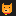

# Rusty — Learn Rust by Doing



**Rusty** is a 100% Rust native desktop application that teaches Rust by guiding learners through real `cargo` invocations inside an embedded terminal, against a sandboxed workspace of real cargo projects.

It is named after the author's dog, **Rusty** (a large, friendly, orange dog), who acts as the application's mascot.

---

## Getting Started

Rusty is distributed GitHub-native — the repository is the product. You install Rusty by compiling it from source using your own Rust toolchain:

### Unix (macOS / Linux)
```bash
git clone https://github.com/crussella0129/rusty.git
cd rusty
chmod +x install.sh
./install.sh
```

### Windows
```powershell
git clone https://github.com/crussella0129/rusty.git
cd rusty
.\install.ps1
```

The bootstrap setup guide will:
1. **Detect** your local Rust installation. If missing, it will prompt you to install it via the official rustup script.
2. **Build Rusty** from source in release mode.
3. **Launch** the resulting native application.

---

## Keyboard Navigation

Rusty is fully keyboard-accessible. You can easily switch focus between the primary panels using the following global shortcuts:

| Shortcut | Action |
| --- | --- |
| **`F1`** or **`Alt + L`** | **Focus Lesson Pane** (selects active Check buttons or input boxes) |
| **`F2`** or **`Alt + E`** | **Focus Code Editor** (places cursor directly into the file buffer) |
| **`F3`** or **`Alt + T`** | **Focus sandboxed Terminal** (activates typing input in the terminal) |

---

## Features

- **Embedded PTY Terminal**: Run real commands against a sandbox directory. Attempts to escape are blocked for safety.
- **rust-analyzer Integration**: Built-in LSP client fetches type info, hovers, completions, and gutter warning/error underlines in real-time.
- **AST-Based Grading**: Submissions are graded using `cargo test` and analyzed using the `syn` parser to suggest idiomatic practices.
- **Spaced Repetition (SM-2)**: Concepts are tracked individually and reviewed on spaced intervals before moving to new lessons.
- **Mascot Companion**: Rusty (the dog) stays pinned at the bottom-right of the lesson pane, keeping you company. He tilts his head when there are warnings/errors to solve and wags his tail when checks pass.

---

## Documentation

For deep dives into pedagogy, curriculum authoring, and architecture, explore the `docs/` folder:
- [INSTALL.md](docs/INSTALL.md) — Detailed installation and system requirements.
- [ARCHITECTURE.md](docs/ARCHITECTURE.md) — Subprocess details (PTY, LSP, Grader).
- [PEDAGOGY.md](docs/PEDAGOGY.md) — Research citations on spaced repetition and retrieval practice.
- [CONTENT_AUTHORING.md](docs/CONTENT_AUTHORING.md) — Guide to adding custom lessons.
